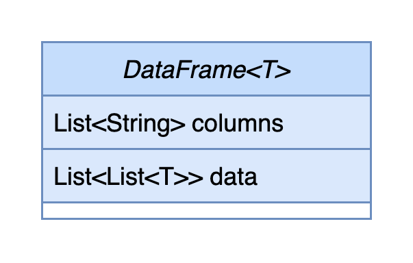
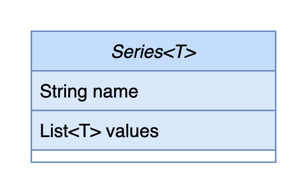

# DataFrame 与 Series

DataFrame 和 Series 是本系统中数据分析和数据处理重要的请求参数数据结构。


## DataFrame

`DataFrame` 是一种通用的矩阵数据结构，在本系统中，一个 API 需要一个多列的数据，通常用此数据结构表示。

在接口文档中，如果要求数据的类型，则会用 `DataFrame[T]` 表示，如 `DataFrame[Float]` 表示 `data` 的类型为 `List<List<Float>` 。

### 类图




+ columns：列名
+ data：二维矩阵列表，每个元素表示一行


### 约束

+ `data` 中的每个列表长度必须一致
+ `columns` 的长度与 `data` 的每一个列表长度必须一致
+ `columns` 中不能出现重复元素
+ `columns` 中不能出现空指针 `null`


### 样例

现有以下数据：

| No.  | Age  | Name | Score |
| ---- | ---- | ---- | ----- |
| 1    | 18   | 张三 | 60    |
| 2    | 20   | 李四 | 80    |
| 3    | 30   | 王五 | 90    |

则该数据的 DataFrame JSON 为

```json
{
  "columns": ["No.", "Age", "Name", "Score"],
  "data": [
    [1, 18, "张三", 60],
    [2, 20, "李四", 80],
    [3, 30, "王五", 90]
  ]
}
```


### Java 中 DataFrame 的 class 定义

```java
public class DataFrame<T> {
  
  /**
   * 列名
   */
  private List<String> columns;
  
  /**
   * 数据
   */
  private List<List<T> data;
  
}
```


## Series

`Series` 是一种携带列名的单列数据结构，在本系统中，一个 API 如果需要一个单列的数据，通常使用此数据表示。

在接口文档中，如果要求数据类型，则会用 `Series[T]` 表示，如 `Series[Float]` 表示 `values` 的类型为 `List<Float>`。


### 类图




### 样例


### 包含列名的 Series

现有以下数据

| Age  |
| ---- |
| 18   |
| 20   |
| 30   |

则该数据的 Series JSON 为

```json
{
  "name": "Age",
  "values": [18, 20, 30]
}
```


### 不包含列名的 Series

现有以下数据

|      |
| ---- |
| 18   |
| 20   |
| 30   |

则该数据的 Series JSON 为

```json
{
  "name": null,
  "values": [18, 20, 30]
}
```

